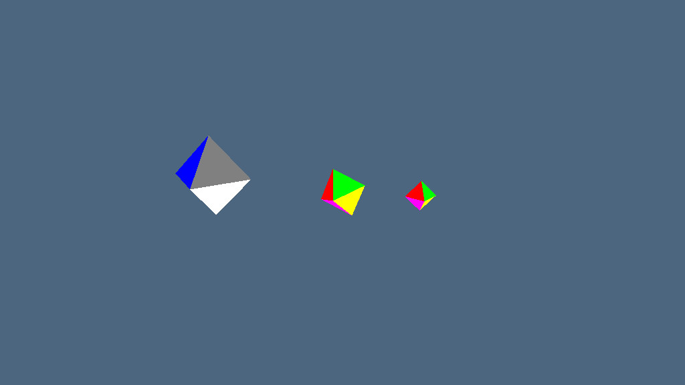

# Solar-System-Simulation

This project was completed as part of my Computer Graphics course. It is a 3D simulation of a simplified solar system consisting of the Earth, Moon, and Sun. Each model is rendered as an octahedron, and hierarchical transformations are applied to simulate their orbits and rotations accurately. The program also includes an interactive camera system that allows the user to switch the viewing focus between the Earth, Moon, and Sun.

